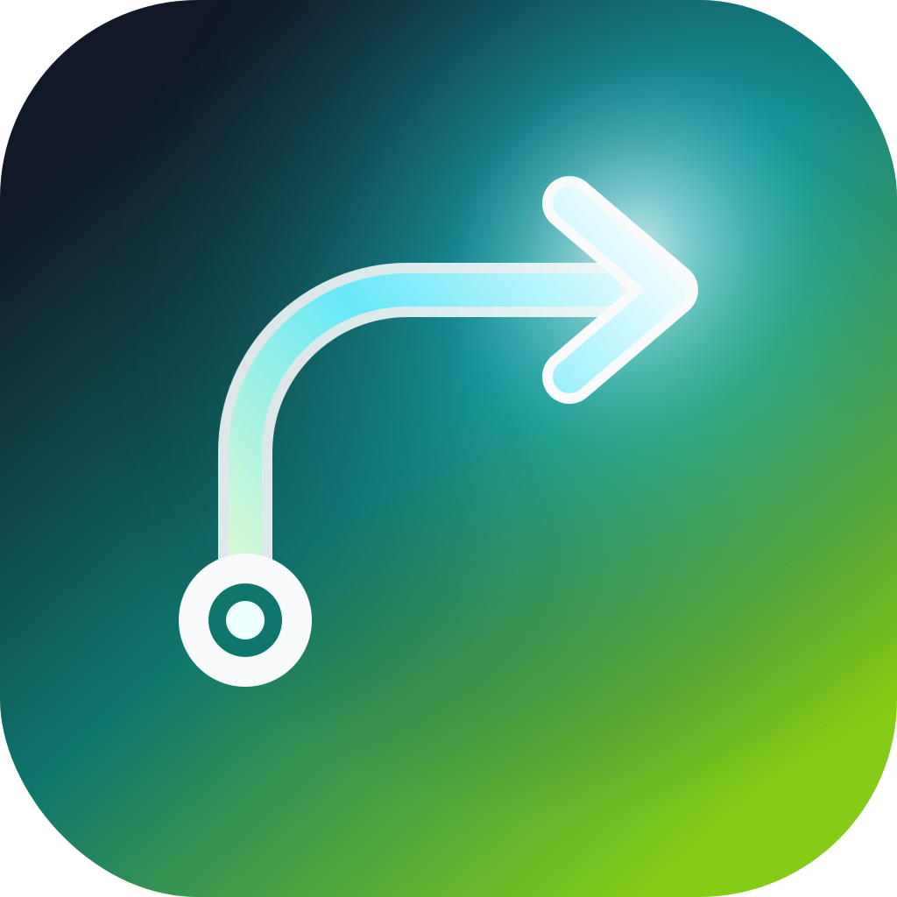

<p align="center">
  
</p>

<h1 align="center">Gestur</h1>

<p align="center">
  <strong>Fast browser mouse gestures for macOS.</strong>
</p>

<p align="center">
  <a href="#features">Features</a> &bull;
  <a href="#supported-browsers">Supported Browsers</a> &bull;
  <a href="#getting-started">Getting Started</a> &bull;
  <a href="#development">Development</a> &bull;
  <a href="#architecture">Architecture</a>
</p>

<p align="center">
  
  
  
  
  <a href="https://github.com/wygoralves/gestur/releases/latest"></a>
</p>

---

Gestur is a small native macOS menu-bar utility that brings Vivaldi-style mouse gestures to the browsers you actually use.

Hold your configured mouse button, draw a simple direction, and release. Gestur recognizes the gesture globally, matches the frontmost browser profile, suppresses the original click only when a real gesture happened, and dispatches the matching browser action.

It is not a browser extension. Gestur runs at the macOS input layer, so gestures can work over page content, browser chrome, tab bars, address bars, and toolbar areas.

## Features

### Browser gestures

- Configurable mouse-button drag gestures for browser actions
- Default commands for new tab, close tab, previous tab, next tab, reopen closed tab, back, forward, and reload
- Original-click preservation when the movement does not become a gesture
- Browser-only mode so gestures do not interfere with normal desktop apps
- Per-browser profiles with editable shortcuts and gesture tokens
- Optional required modifier keys for gesture starts

### Native macOS utility

- Lightweight Swift menu-bar app with no web runtime
- CoreGraphics event tap for low-level mouse gesture recognition
- SwiftUI settings window for profiles, rules, permissions, and diagnostics
- Optional launch-at-login support
- Import/export for the JSON configuration

### Browser-specific handling

- Chromium-family browsers use stable arrow-based tab shortcuts
- Safari and Firefox use their native control-tab conventions
- Vivaldi uses AppleScript tab-order switching so left/right gestures follow displayed tab order
- Dia uses Dia's scripting interface to switch tabs directly without opening menus or relying on punctuation keycodes

## Supported Browsers

| Browser profile | Bundle IDs | Tab switching |
|---|---|---|
| Vivaldi | `com.vivaldi.Vivaldi` | AppleScript by displayed tab order |
| Dia | `company.thebrowser.dia` | Dia scripting API |
| Chromium browsers | Chrome, Chrome Canary, Brave, Edge, Opera | `⌘⌥←` / `⌘⌥→` |
| Safari | `com.apple.Safari` | `⌃⇧Tab` / `⌃Tab` |
| Firefox | `org.mozilla.firefox` | `⌃⇧Tab` / `⌃Tab` |

Unknown apps pass through untouched by default. You can add custom app profiles from the menu or Settings.

## Default Gestures

| Gesture | Action |
|---|---|
| `U` | New tab |
| `D` | Close tab |
| `L` | Previous tab |
| `R` | Next tab |
| `DU` | Reopen closed tab |
| `UL` | Back |
| `UR` | Forward |
| `UD` | Reload |

Gestures use direction tokens: `U` up, `D` down, `L` left, and `R` right. Use the record button in a gesture row to draw a gesture instead of typing the token manually.

## Getting Started

### Install on macOS

```bash
brew install --cask wygoralves/tap/gestur
```

Homebrew is the primary macOS install path for prebuilt Gestur releases. The cask installs the release DMG from GitHub and applies a best-effort quarantine removal step after install.

Gestur is not currently signed and notarized with Apple, so Homebrew reduces Gatekeeper friction but does not eliminate it. macOS may still require a manual first-launch confirmation depending on system policy. If that happens, use Finder's Open flow or download the DMG directly from [GitHub Releases](https://github.com/wygoralves/gestur/releases/latest).

If Gatekeeper blocks a direct DMG install, use these commands instead of disabling Gatekeeper globally:

```bash
# If macOS blocks the downloaded DMG itself
xattr -d com.apple.quarantine ~/Downloads/Gestur*.dmg
open ~/Downloads/Gestur*.dmg

# After dragging Gestur.app into /Applications, if first launch is blocked
xattr -dr com.apple.quarantine /Applications/Gestur.app
open /Applications/Gestur.app
```

Maintainers can find the tap/release automation setup in [docs/homebrew-distribution.md](./docs/homebrew-distribution.md).

### Prerequisites

| Requirement | Version |
|---|---|
| macOS | 13.0+ |
| Xcode Command Line Tools | Swift 5.9-compatible |
| `rsvg-convert` | Optional, for generating `.icns` app icons during packaging |

Install the command line tools if Swift is missing:

```bash
xcode-select --install
```

Install `rsvg-convert` with Homebrew if you want packaged app icons:

```bash
brew install librsvg
```

### Run from Source

```bash
swift run Gestur
```

The app runs as a menu-bar utility. On first launch, open the menu-bar icon and grant the missing permissions from Settings.

### Build the App Bundle

```bash
Scripts/build-app.sh
open dist/Gestur.app
```

Use the bundled app when testing launch-at-login. `swift run Gestur` is useful during development, but macOS login-item registration expects a real `.app` bundle.

### Sign a Local Build

Unsigned local builds remain the default. To sign with a local or Developer ID identity:

```bash
SIGN_IDENTITY="Gestur Local Code Signing" Scripts/build-app.sh
```

To submit a Developer ID-signed app for notarization with an existing notarytool keychain profile:

```bash
SIGN_IDENTITY="Developer ID Application: Your Name (TEAMID)" \
NOTARIZE_PROFILE="gestur-notary" \
Scripts/build-app.sh
```

Notarization requires an Apple Developer Program Developer ID certificate. Local signing is useful for your own machine, but it does not notarize the app.

## Permissions

Gestur needs macOS privacy permissions because it observes mouse input globally and sends browser commands.

| Permission | Why it is needed |
|---|---|
| Accessibility | Send browser commands and synthetic shortcuts |
| Input Monitoring | Observe mouse gestures while other apps are frontmost |
| Automation | Control browser-specific tab switching in Vivaldi and Dia |

Gestur will not start the event tap until Accessibility and Input Monitoring are granted.

## Configuration

Gestur stores its editable JSON configuration in:

```text
~/Library/Application Support/Gestur/config.json
```

The settings window includes import/export actions so you can back up profiles or move them between Macs.

## Diagnostics

Settings includes a diagnostics view for checking:

- Current frontmost app
- Matched browser profile
- Event tap state
- Permission state
- Last gesture token
- Last matched action
- Last event decision

Enable the gesture overlay from Settings when tuning recognition. It shows the drawn path, recognized token, and matched action while dragging.

## Development

```bash
swift build                 # compile all products
swift run Gestur            # run the menu-bar app
swift run GesturValidation  # run the validation suite
Scripts/build-app.sh        # build dist/Gestur.app
Scripts/package-release.sh v0.1.0  # build local release DMG/zip assets
```

The validation runner exists because this project intentionally avoids a heavier test harness. It currently covers gesture recognition, profile matching, shortcut key mapping, default-config migration, and config import/export.

### Release

Releases are built by GitHub Actions from either a pushed version tag or the manual `CI and Release` workflow.

```bash
git tag v0.1.0
git push origin v0.1.0
```

The release workflow builds `Gestur.app`, packages a DMG and zip archive, uploads them to GitHub Releases, and publishes `wygoralves/tap/gestur` when the `HOMEBREW_TAP_TOKEN` repository secret is configured.

## Architecture

Gestur is a native Swift Package with a small app target, a reusable core target, and a command-line validation target.

| Layer | Technology |
|---|---|
| App shell | AppKit menu-bar app |
| Settings UI | SwiftUI |
| Event capture | CoreGraphics `CGEventTap` |
| Gesture recognition | Custom lightweight path recognizer |
| Browser matching | Bundle ID profiles |
| Action dispatch | Synthetic `CGEvent` shortcuts plus browser-specific AppleScript |
| Persistence | JSON config in Application Support |
| Packaging | Shell script, Info.plist, entitlements, generated app bundle |

Generated app bundles are written to `dist/`. Build artifacts under `.build/` and packaged output under `dist/` can be regenerated at any time.
